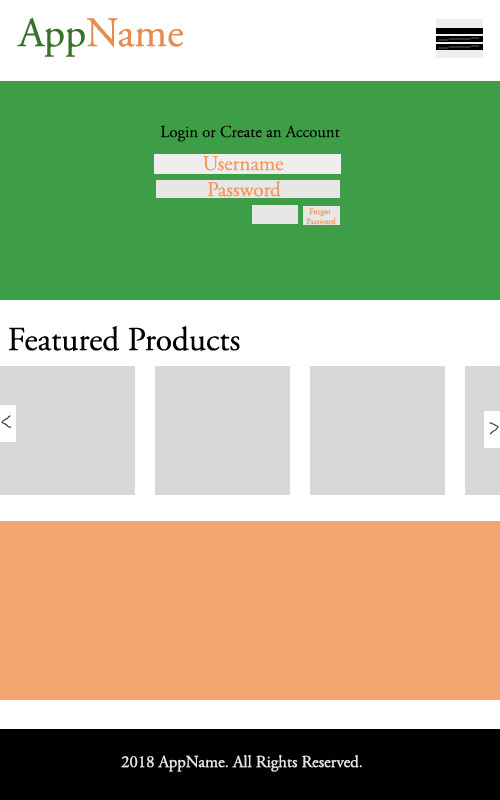
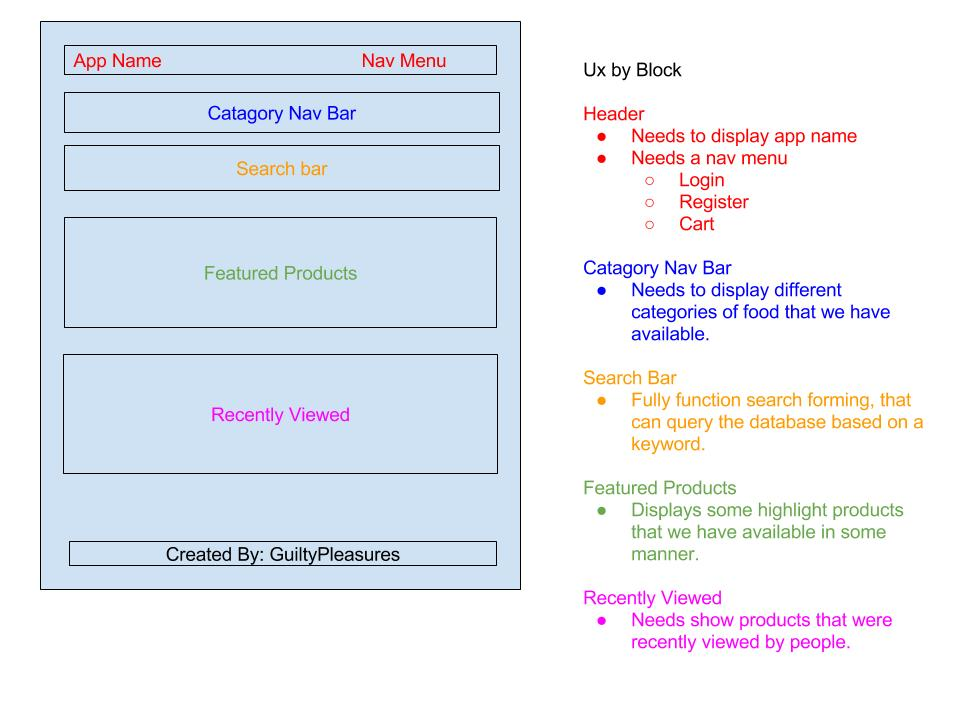
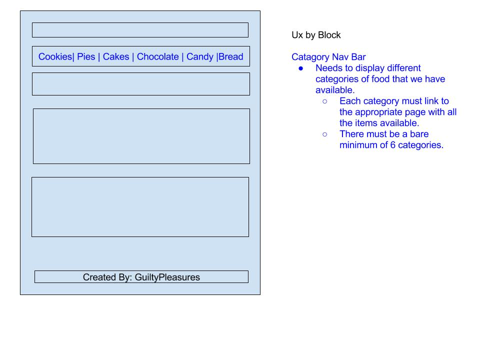
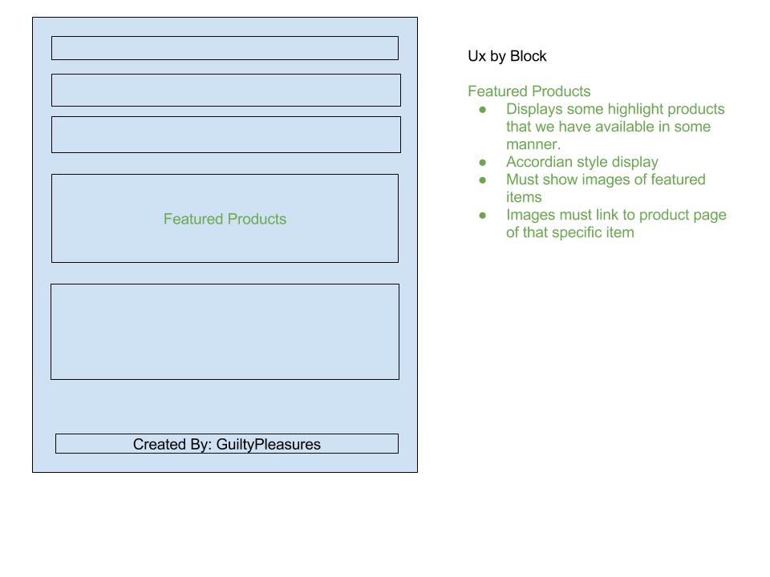
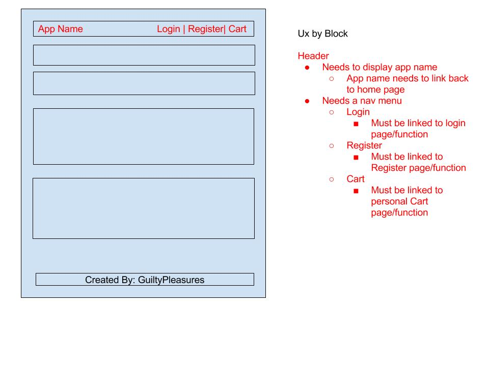
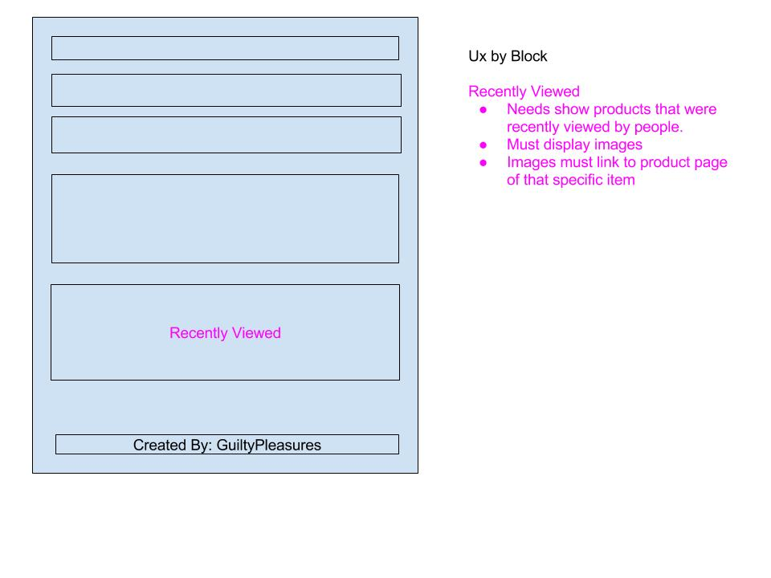
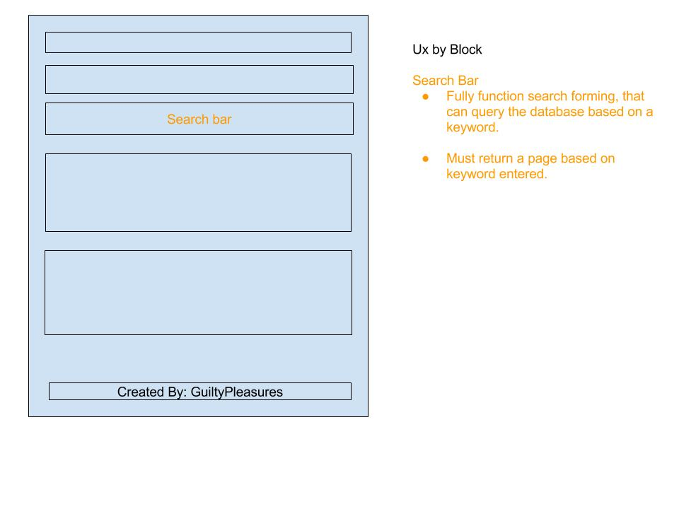

# MealTicket

## Overview

MealTicket is an e-Commerce web app that allow local Atlanta home chefs to participate as vendors by selling their specialty dishes or baked goods and consumers can look up certain dishes/baked goods or vendors to purchase and place orders in advance. 

#### Teams
+ **Backend**: [Jay Huang](https://www.github.com/aznprox) and [Brad Whitcomb](https://www.github.com/)
+ **Frontend**: [Juanita Pinkney](https://www.github.com/juanitanpinkney) and [Brian Peace](https://www.github.com/bpeace71)
+ **Project Manager and Frontend/Backend (Floater)**: [Keli Chau](https://www.github.com/kelichau)

#### Assignment
This application is a final group project for [GA Tech's Coding Boot Camp](https://codingbootcamp.pe.gatech.edu/), Full-Time Fall 2017 Cohort. Collaborators include:[Jay Huang](https://www.github.com/aznprox), [Brad Whitcomb](https://www.github.com/), [Juanita Pinkney](https://www.github.com/juanitanpinkney), [Brian Peace](https://www.github.com/bpeace71), and [Keli Chau](https://www.github.com/kelichau).

##### Requirements
+ Must use ReactJS in some way (even if minimal)
+ Must use a Node and Express Web Server
+ Must be backed by a MySQL or MongoDB Database with a Sequelize or Mongoose ORM  
+ Must have both GET and POST routes for retrieving and adding new data
+ Must be deployed using Heroku (with Data)
+ Must utilize at least two libraries, packages, or technologies that we haven’t discussed
+ Must allow for or involve the authentication of users in some way
+ Must have a polished frontend / UI 
+ Must have folder structure that meets MVC Paradigm
+ Must meet good quality coding standards (indentation, scoping, naming)
+ Must not expose sensitive API key information on the server

##### User Story

### Visuals

## Acknowledgments

## Future Plans
